# WeddingShare

  

## Support

Thank you to everyone that supports this project. For anyone that hasn't yet I would be grateful if you would show some support by "buying me a coffee" through the link below. Weddings are expensive and all proceeds from this project will be going towards paying off my wedding bills.

- BuyMeACoffee - https://buymeacoffee.com/cirx08
- GitHub Sponsors - https://github.com/sponsors/Cirx08

## About

WeddingShare is a very basic site with only one goal. It provides you and your guests a way to share memories of and leading up to the big day. Simply provide your guests with a link to a gallery either via a Url or even better by printing out the provided QR code and dropping it on your guests' dinner tables. Doing so will allow them to view your journey up to this point such as dress/suit shopping, viewing the venue, doing the food tasting or cake shopping, etc. 

You are not limited to a single gallery. You can generate multiple galleries all with their own sharable links. At this stage galleries are a bit unsecure, meaning anyone with the link has access to view and share images so I recommend keeping your share links private. To combat strangers gaining access to your galleries you can provide a secret key during setup but be advised this is a deterrent to make guessing Urls slightly harder and not an actual security catch all. 

## Disclaimer

Warning. This is open-source software (GPL-V3), and while we make a best effort to ensure releases are stable and bug-free,
there are no warranties. Use at your own risk.

## Demo
Give it a shot first - https://demo.wedding-share.org/

## Notes

Not all image formats are supported in browsers so although you may be able to add them via the ALLOWED_FILE_TYPES environment variable they may not be supported. One such format is Apples .heic format. It is specific to Apple devices and due to its licensing, a lot of browsers have not implemented it.

## Documentation & Setup
For a setup steps and a full list of configurable options please view the documentation site - https://docs.wedding-share.org.

## Links
- Documentation - https://docs.wedding-share.org
- GitHub - https://github.com/Cirx08/WeddingShare
- DockerHub - https://hub.docker.com/r/cirx08/wedding_share
- BuyMeACoffee - https://buymeacoffee.com/cirx08
- GitHub Sponsors - https://github.com/sponsors/Cirx08

## Screenshots

### Desktop

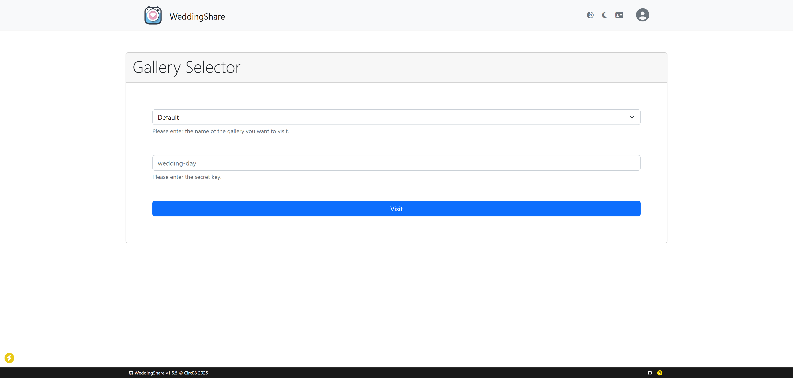

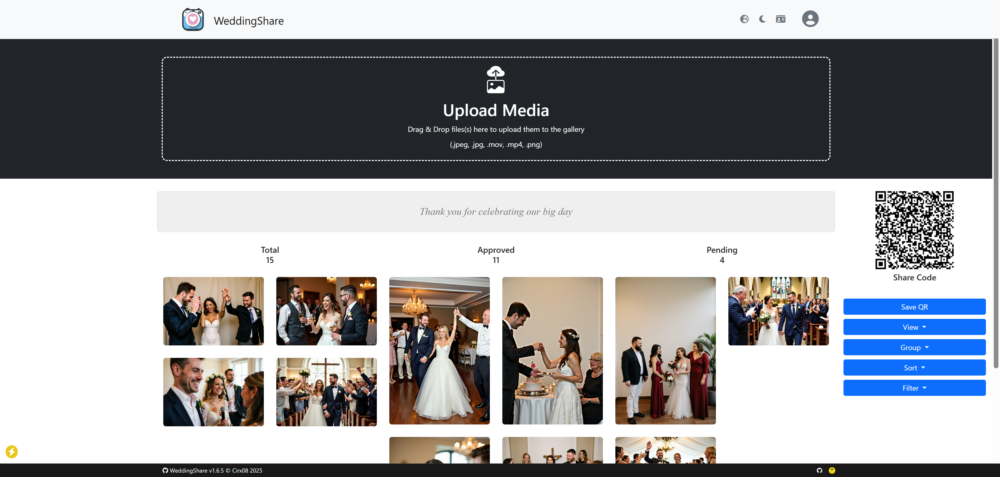

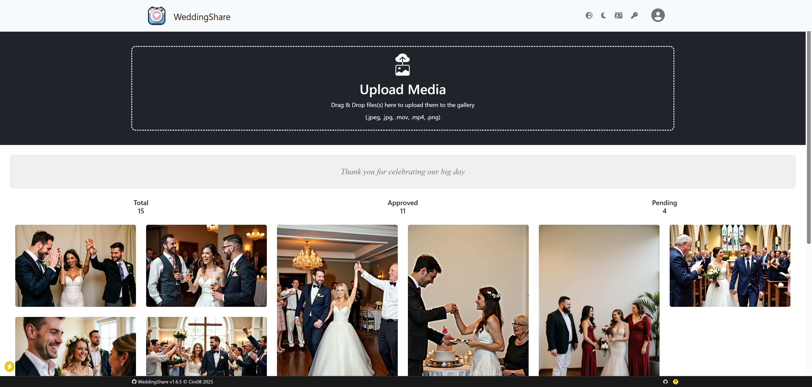

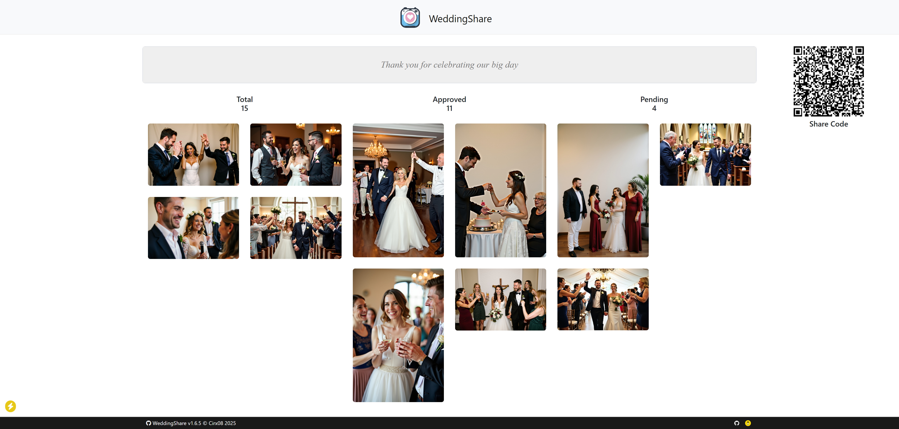

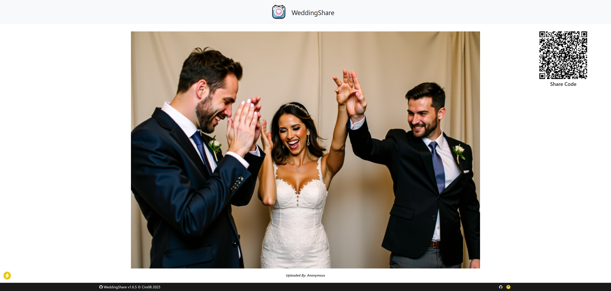

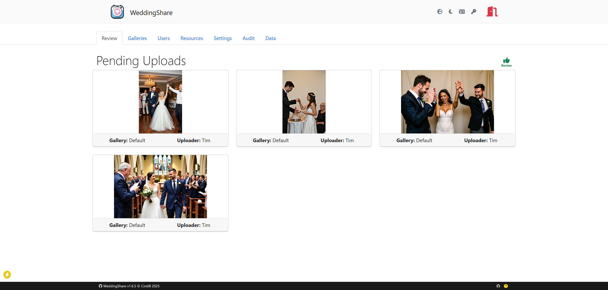

### Mobile

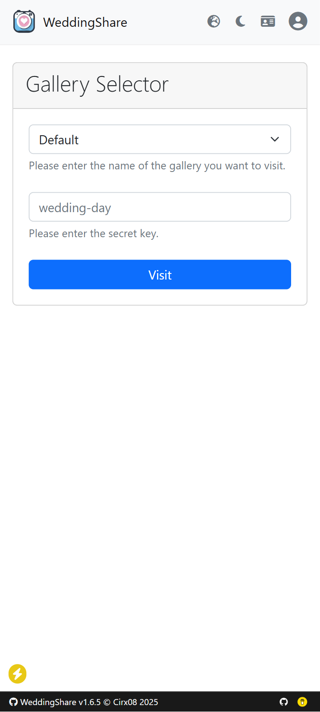

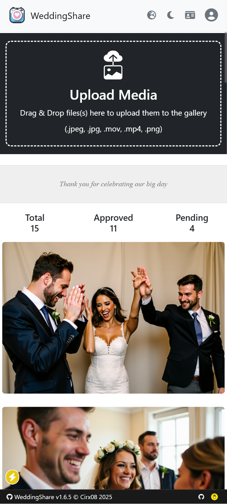

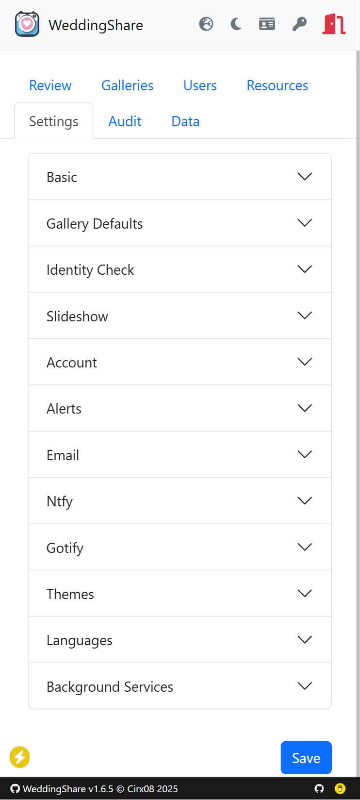

### Dark Mode

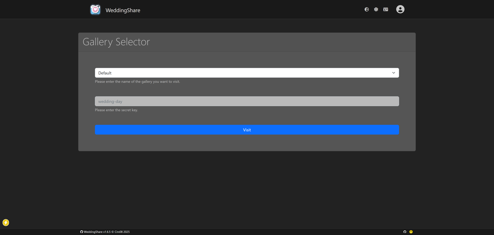

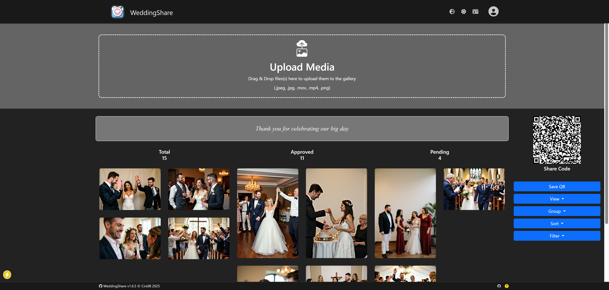

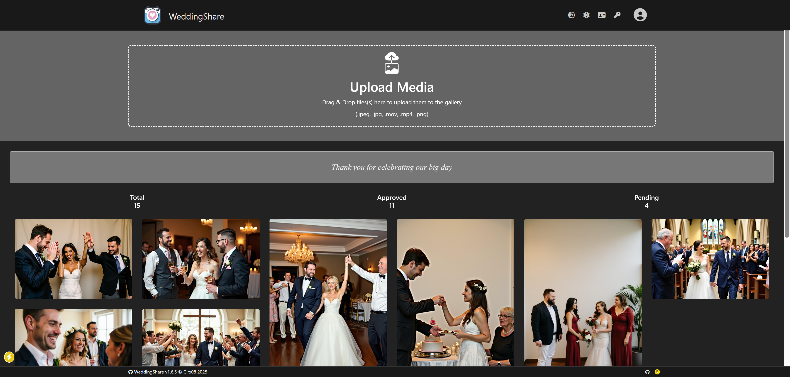

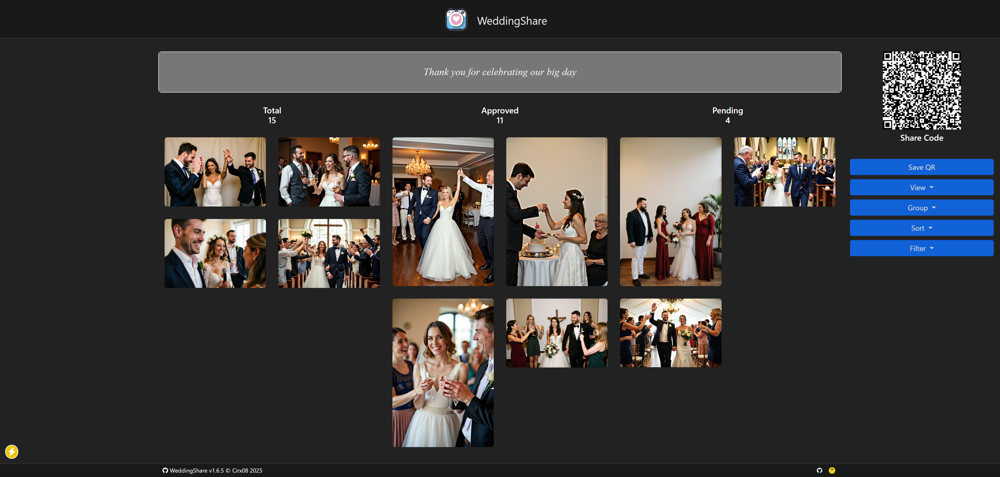

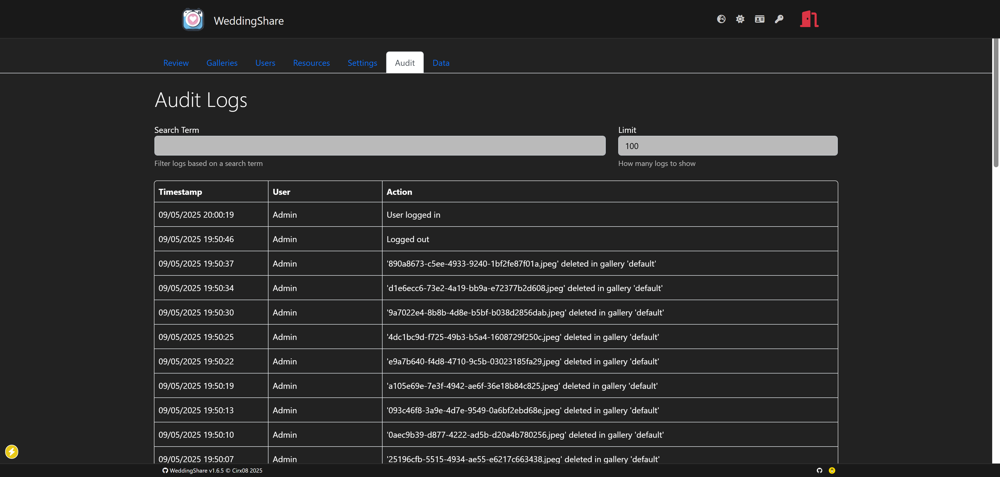

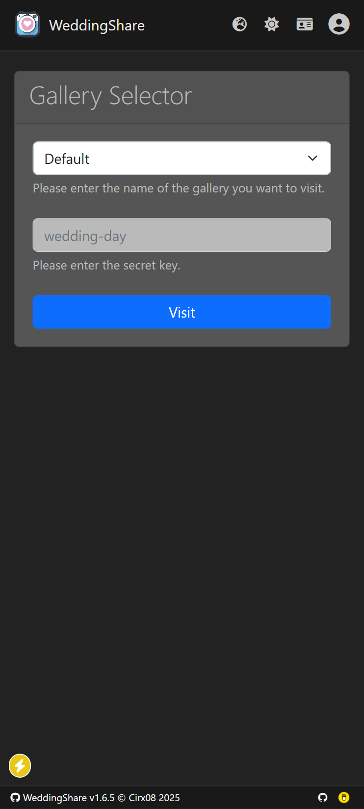

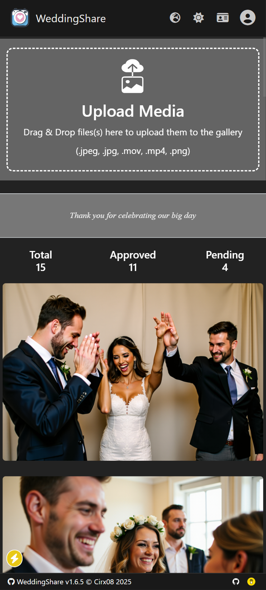

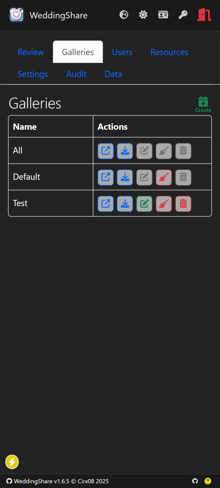